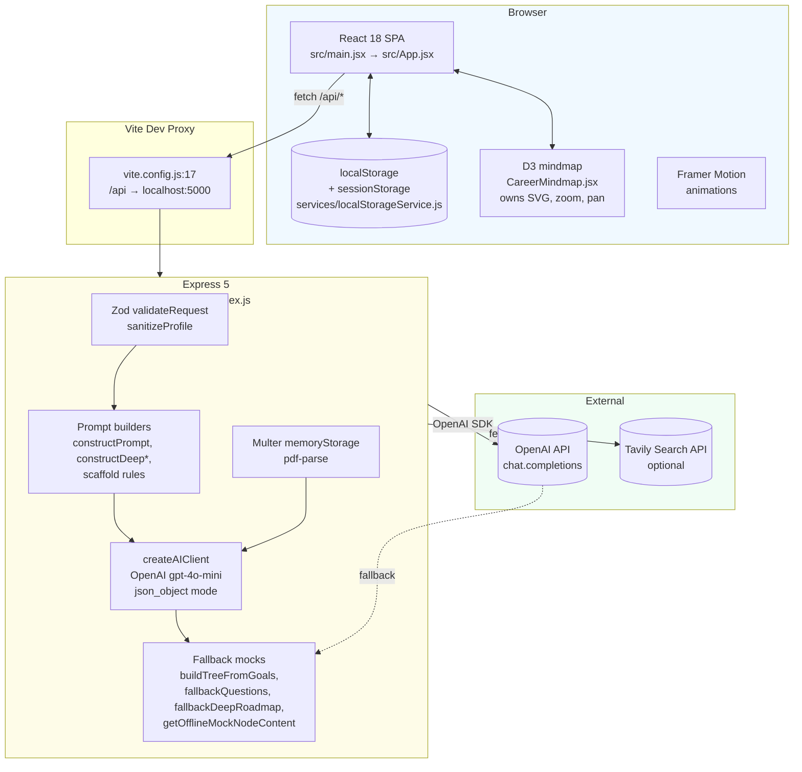
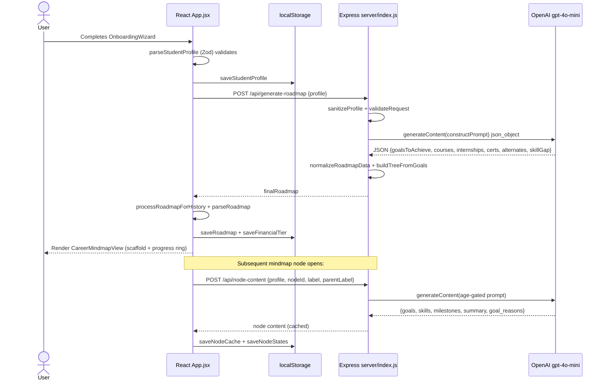

# 03 — System Architecture

## Overall Architecture

Career GPS is a **client-heavy SPA + thin proxy backend** — no database, no auth. The browser holds all user state; the backend's job is to (a) sanitize inputs, (b) validate via Zod, (c) proxy structured JSON requests to OpenAI, and (d) return normalized results. When OpenAI is unavailable, the backend returns deterministic mock data so the frontend never breaks.



---

## Frontend (`src/`)

**Framework:** React `^18.3.1` with Vite `^7.0.0` (`package.json:24,28`). Entry: `src/main.jsx` mounts `<App />` inside a `GlobalErrorBoundary` that clears `localStorage` on fatal crashes (`main.jsx:20-23` + message at `main.jsx:42-44`).

### View Router (`src/App.jsx:22-29`)

`VIEWS` enum: `WELCOME | ONBOARDING | GENERATING | TIMELINE | ROADMAP | MINDMAP`. State machine in `App`:

- Hydrates `profile` + `roadmap` from `localStorageService` on mount; validates via `parseStudentProfile`/`parseRoadmap`; on failure clears storage (`App.jsx:37-52`).
- `handleProfileComplete` POSTs profile, calls `processRoadmapForHistory` (prefixes milestones for multi-phase history), validates via Zod, saves, then shows `MINDMAP` (`App.jsx:54-101`).
- Fallback: if `fetch` throws, calls local `generateMockRoadmap` (`src/data/mockRoadmapGenerator.js`) — app never blocks (`App.jsx:87-99`).
- `handleReset` clears all `career-gps:*` keys and returns to `WELCOME` (`App.jsx:105-111`).

### Components

| Directory | Key components | Responsibility |
|-----------|----------------|----------------|
| `components/onboarding/` | `OnboardingWizard.jsx` (12 steps) | Collect & validate profile; suggest skills for OTHER fields |
| `components/roadmap/` | `RoadmapDashboard.jsx`, `CareerMindmapView.jsx`, `CareerMindmap.jsx`, `MindmapNodePopover.jsx`, `CheckpointPanel.jsx`, `DeepOptimizationWizard.jsx`, `ProgressRing.jsx` | Dashboard tabs, mindmap shell, D3 SVG, popovers, deep wizard, progress |
| `components/timeline/` | `TimelineView.jsx`, `TimelineNode.jsx` | Linear milestone timeline with `timelineTransformer.js` |
| `components/pathforge/` | `ResumeAnalyzer.jsx`, `MarketIntelligence.jsx`, `CareerChat.jsx`, `SkillMap.jsx` | Ancillary panels inside dashboard |
| `components/ui/` | `gradient-background.jsx`, `holographic-card.jsx`, `web-gl-shader.jsx` | Visual effects (Three.js WebGL) |

**React ↔ D3 boundary:** React renders an empty `<svg ref>`; D3 owns nodes, links, transitions, zoom. From `docs/phase-notes.md:22`: *"React renders only the empty SVG ref; D3 owns all nodes, links, transitions, zoom, and click behavior."*

### Styling

- Tailwind CSS `^3.4.17` with custom tokens (`tailwind.config.js:22-28` — `ink`, `mist`, `sage`, `ocean`, `coral`, `soft` shadow; Graphik font stack).
- `src/styles/index.css` for global overrides; Vanilla CSS classes like `.custom-checkbox`, `.card-emerald-glow`, `.link-flow`.

### State & Persistence

No global store (no Redux/Zustand/Context provider). Component-local `useState` + `services/localStorageService.js` imperative helpers. See `04_Data_Model.md` for keys.

---

## Backend (`server/index.js`, ~2300 lines)

Single Express app (`app`). Also re-exported as Vercel serverless function via `api/index.js:1-2`.

### Request Pipeline (every endpoint)

```
fetch /api/* (JSON or multipart)
  → express.json()                     (line 187)
  → upload.single("resume")            (resume only)
  → sanitizeProfile / sanitizeInput    (11-78, 98-103, 146-153)
  → validateRequest(Zod schema) → 400  (146-153)
  → handler → genAI check (null→fallback)
  → OpenAI generateContent(JSON prompt) with response_format json_object
  → cleanGeminiJsonResponse (strip ``` fences)
  → JSON.parse → normalizeRoadmapData
  → buildTreeFromGoals (programmatic tree)
  → res.json
  → catch → high-fidelity mock (isMock:true)
```

### AI Adapter (`server/index.js:206-227`)

`createAIClient(apiKey)` wraps `new OpenAI({apiKey})` to preserve the previous Gemini call shape `getGenerativeModel({model}).generateContent(prompt) → {response:{text()}}` so all handlers remain unchanged. Every completion uses `temperature:0.2` and `response_format:{type:"json_object"}`.

### Endpoints (summary — details in `05_API_Documentation.md`)

| Method | Path | Handler lines | Needs OpenAI? |
|--------|------|---------------|---------------|
| POST | `/api/generate-roadmap` | 771-950 | Yes (fallback mock if not) |
| POST | `/api/generate-deep-questions` | 1081-1112 | Yes |
| POST | `/api/generate-deep-roadmap` | 1114-1150 | Yes |
| POST | `/api/suggest-skills` | 1167-1198 | Yes (empty array fallback) |
| POST | `/api/analyze-resume` | 1200-1351 | Yes (mock analysis fallback) |
| POST | `/api/market-intelligence` | 1353-1500 | Yes (optional Tavily enrichment) |
| POST | `/api/career-chat` | 1502-1597 | Yes |
| POST | `/api/node-content` | 2057-~2260 | Yes (offline `getOfflineMockNodeContent`) |
| POST | `/api/checkpoint` | ~2140+ | Yes |

### Build Order

1. **Scaffold is structure-only** — `buildMindmapScaffold(profile)` produces nodes without goals/skills (`src/data/scaffoldBuilder.js:391`).
2. **Roadmap milestones** are generated via AI or mock, then `buildTreeFromGoals` links them linearly into `decisionTree` (`server/index.js:230-309`).
3. **Multi-phase history**: `processRoadmapForHistory` (`src/utils/roadmapHelpers.js:560-711`) prefixes milestone IDs (`p1-`, `p2-`…) and concatenates earlier-phase milestones so re-onboarding preserves history.

---

## Data & Storage

- **No database.** Browser `localStorage` (10 keys) + `sessionStorage` (zoom/expanded). Defined in `services/localStorageService.js:1-21`. Logical ERD in `04_Data_Model.md`.
- **Files:** Resume PDFs uploaded as `memoryStorage` buffers, parsed with `pdf-parse` (`server/index.js:174,1244`), never persisted to disk.

---

## Deployment Environment

| Env | Frontend | Backend | Config |
|-----|----------|---------|--------|
| Local dev | Vite `npm run dev -- --port 5173` proxied `/api` → `localhost:5000` (`vite.config.js:17-23`, `README.md:52-58`) | `node server/index.js` on `PORT` | `.env` (not committed) |
| Production (Vercel) | `npm run build` → `dist/` (`vercel.json:3-4`) | Serverless `api/index.js` exporting `app` (`vercel.json:7`) | Vercel env vars |
| Windows quick-start | `start-career-gps.bat` spawns backend then Vite |  |  |

Rewrites: `vercel.json:6-9` — `/api/(.*)` → `/api`, else → `/index.html` (SPA fallback).

---

## Request / Data Flow (Happy Path)



---

## Security Model (at this layer)

- `sanitizeInput`/`sanitizeProfile` strip prompt-injection markers (`System:`, `User:`, `###`, ` ``` ` etc.) and cap lengths (`server/index.js:11-78`).
- Zod schemas on every `POST` body reject malformed/empty inputs with `400`.
- `OPENAI_API_KEY` stays server-side; `dotenv.config(override:true)` (`server/index.js:171`) ensures `.env` wins.
- **Not present:** auth, CORS allowlist, rate limiting, helmet, CSRF. See `17_Security_and_Privacy.md`.

---

## Limitations & Trade-offs

- **Pros of no DB:** zero infra, instant offline fallback, no auth complexity, easy Vercel deploy.
- **Cons:** no multi-device sync, no recovery after storage clear, no collaborative features, limited to ~5-10 MB `localStorage` quota (with quota-recovery fallback at `localStorageService.js:42-62`).
- **Frontend owns too much state:** scattered `useState` + manual `reevaluateStates` copies in both `CareerMindmapView.jsx` and `RoadmapDashboard.jsx` — high duplication and drift risk (see `12_Known_Issues_and_Limitations.md`).
