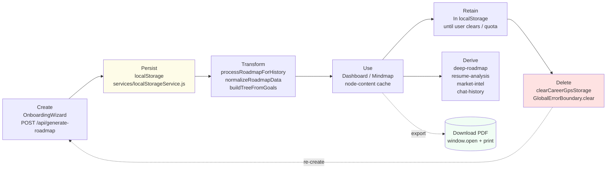

# 23 — Data Lifecycle, Backup, and Recovery

## Lifecycle Model (No Database)

Career GPS is **local-storage-only**. Data never resides in a server database; the backend is stateless. The entire lifecycle is in-browser.



---

## Stages

### Create

- **When:** On onboarding completion (`src/App.jsx:54`) and on each `POST /api/*` call (roadmap, deep plan, resume, market, chat, node-content).
- **Validation:** Zod (`src/schemas/roadmapSchemas.js` + `server/index.js:81-144`) and sanitization (`server/index.js:11-78`). Invalid input returns `400` and does not persist.
- **Fallback creation:** If the API call fails or `404` (B-01 endpoint drift), `App.jsx:88` creates a client-side `generateMockRoadmap` — still persisted via `saveRoadmap`/`saveStudentProfile`.

### Transform / Derive

- **History prefixing:** `processRoadmapForHistory` (`src/utils/roadmapHelpers.js:560-711`) prefixes milestone IDs by phase (`p1-`, `p2-`…) and concatenates earlier-phase milestones so re-onboarding does not overwrite prior phases.
- **Normalization:** `normalizeRoadmapData` (`server/index.js:615-769`) restamps timeframes, fixes `bridgingSteps`, coerce IDs — the post-LLM fixer.
- **Derived stores:** `deepRoadmap` (6-week plan), `resumeAnalysis`, `marketIntel`, `chatHistory`, `nodeCache`/`nodeStates`/`completedGoals` are each derived from the primary roadmap/profile but stored separately (`services/localStorageService.js:1-21`).

### Store

| Key | Location | Mutability | Evidence |
|-----|----------|------------|--------|
| All `career-gps:*` | `localStorage` (JSON) | Read-write per origin | `services/localStorageService.js:1-21` |
| `career-gps:mindmap-expanded` + `mindmap-zoom` | `sessionStorage` | Cleared on tab close | `138-160` |
| Resume PDF bytes | `multer.memoryStorage()` in RAM | Ephemeral — parsed then GC'd | `server/index.js:174` |
| Download PDF | Transient new-window `window.open(...).print()` | Not stored; user must save via print dialog | `RoadmapDashboard.jsx:656-765` |

- **Quota:** ~5 MB per origin (browser limit). Mitigated by `safeSetItem` trimming `nodeCache` then `chatHistory` on `QuotaExceededError` (`services/localStorageService.js:42-62`). That mitigation **silently deletes cached content** (re-fetchable but unexpected).

### Retain / Access

- Retention is **indefinite** until browser data is cleared, quota trimming removes cache, or `clearCareerGpsStorage()` is called.
- Access requires the same origin + browser profile. No cross-device sync.

### Delete

- **User-initiated:** **Edit Profile / Restart** (`Dashboard.jsx:650-654`, `App.jsx:105-111`) → `clearCareerGpsStorage()` → wipes every `career-gps:*` across `localStorage` + `sessionStorage` (`services/localStorageService.js:162-179`), returns to Welcome.
- **Crash-initiated:** `GlobalErrorBoundary.handleReset` (`src/main.jsx:21`) → `localStorage.clear()` + reload (used when Zod parse fails on corrupted storage).
- **Implicit:** browser's **Clear site data / Clear Storage**, uninstall, or storage eviction under disk pressure.

---

## Backup

```text
No verified backup/recovery mechanism found.
```

- **There is no server-side persistence to back up.** No DB dump, no snapshot, no cloud bucket, no export JSON endpoint.
- **There is no automatic export to cloud.** The only user-export is **Download PDF** (full printable career guide). That produces a browser print render — not a restorable data file.
- **There is no import / restore of a previously exported snapshot.** A PDF cannot be re-ingested to reconstruct `profile`/`roadmap`/`nodeCache`.

---

## Recovery (What Exists)

| Scenario | What actually happens | Evidence |
|----------|----------------------|---------|
| User accidentally clears storage | Data lost; must re-onboard. The printed/downloaded PDF (if saved) is the last recoverable view, but not restorable into the app. | No import implementation |
| Corrupted JSON in localStorage (truncated write) | `safeParse` returns fallback and warns; if render crashes, `GlobalErrorBoundary` offers **Clear Stored Data & Reset App** → clears and reloads to Welcome | `services/localStorageService.js:28-37`, `main.jsx:39-79` |
| QuotaExceeded | Cache/history trimmed silently → re-fetchable on next interaction | `services/localStorageService.js:42-62` |
| Server restart (Vercel or local `node server/index.js`) | No data loss (none stored server-side) — all data remains in clients' browsers | Stateless backend |
| Deployment rollback | No data to restore — just redeploy `api/index.js` + static `dist/` | `09_Deployment_Guide.md` |
| Disaster recovery (storage loss at scale) | `Not Applicable` — there is no central store to recover |  |

---

## Operational Gaps (Explicit)

| Gap | Risk | Path to close |
|-----|------|--------------|
| No server-side backup (none needed) vs **no client export** that is **restorable** | User data is unrecoverable after device loss | Add `Export JSON` + `Import JSON` (serialize/deserialize all `career-gps:*` keys with schema version). Alternatively add optional cloud sync behind auth. |
| No cross-device sync | Progress isolated per device | Add auth-gated sync or passkey-based export/import. |
| No schema versioning in storage | Future schema changes can corrupt old caches — caught only by `ZodError` → clear all | Add `career-gps:storage-version` key + migration function that upgrades or clears stale keys surgically. |
| No retention policy doc | For GDPR/privacy `Not Confirmed` | Document data residency and TTL once a cloud-backed option is added. |

---

## Recommendations (if this scales)

In priority order:

1. **Add JSON export/import** — buttons in the Dashboard header that `JSON.stringify` the full store blob (with `roadmapSchemas.js` validation on import).
2. **Add `storage-version` + migrations** in `localStorageService.js` before the next schema bump.
3. Add storage-space indicator in the Dashboard to warn before quota-silent trim.
