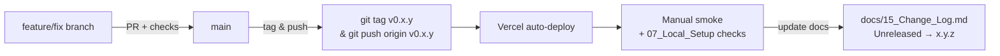

# 24 — Release and Versioning

## Finding

**No formal release/versioning process exists.** This is explicitly documented, not fabricated.

| Candidate evidence | Found? | Detail |
|-------------------|--------|--------|
| `package.json` `version` | Yes | `package.json:5` → `"version":"0.1.0"`, private, no script to bump/tag |
| Git tags (`git tag`) | Not Confirmed | `git log --oneline` shows 4 commits on `main`, tagged versions were not emitted in log output |
| `CHANGELOG.md` at root | Not Found | `docs/15_Change_Log.md` is the hand-maintained log under docs/ — not automated |
| `.github/workflows` release workflow | Not Found | No workflows directory |
| Semantic versioning policy | Not Found | No CONTRIBUTING or RELEASING doc previously existed |
| CI publishing to npm or registry | Not Applicable — app is not a library |  |
| Release notes page | Not Applicable | Not found beyond `CAREER_GPS_OVERVIEW.md` |
| Deployment tag → Vercel promotion rule | Not Found | `vercel.json` deploys on push but not via tagged release gate |

---

## Current De Facto Practice

| Activity | How it happens today |
|----------|---------------------|
| Build | `npm run build` locally or Vercel `buildCommand` (`vercel.json:3`) → `dist/` |
| Release | Push to `main` on `origin` (`https://github.com/aiatozofficial/career-gps.git`) — Vercel redeploys (`vercel --prod` or Git integration) |
| Verification | `npm run validate:phase1` + `npm run build` + manual mindmap smoke (`07_Local_Setup_Guide.md`) |
| Rollback | Vercel → Deployments → Promote previous deployment (`09_Deployment_Guide.md`) |
| Changelog | `git log --oneline` is the only source of truth before this handover; `docs/15_Change_Log.md` was created by this handover (grounded on `git log`) |

There is **no gated `develop` → `main` promotion, no RC tag, no `release.yaml`**.

---

## What to Document After This Handover

Use `docs/15_Change_Log.md` as the human-facing log. Proposed lightweight process for a team of 1–3 maintainers:



1. **Versioning:** SemVer on `package.json:5` — bump before tagging (`0.1.x` patch, `0.x.0` minor, `1.0.0` only when AI contracts stabilize + `isMock` visibility added).
2. **Tagging:**
   ```bash
   git tag -a v0.2.0 -m "alias /api/init-roadmap; add .gitignore"
   git push origin v0.2.0
   ```
3. **Deployment:** Vercel may auto-deploy on tag or on `main` (verify in Vercel Project → Git settings).
4. **Verification:** `curl -X POST https://{deployment}.vercel.app/api/generate-roadmap ...` → `400` for health, onboarding smoke.
5. **Documentation:** Cut an `## [x.y.z] — YYYY-MM-DD` section in `docs/15_Change_Log.md`.
6. **Rollback:** Vercel Dashboard → Deployments → Promote previous.

---

## Until a Release Process Is Adopted

Do not claim release hardening exists. Status remains:

```text
No formal versioning, changelog process, or gated release pipeline is verified.
Current practice is push-to-main → Vercel redeploy, with git log as the sole changelog.
A 0.1.0 → 0.2.0 cut has not been tagged.
```

Future maintainers: do not "invent" tags or release notes. Add them when the process above is actually executed.
