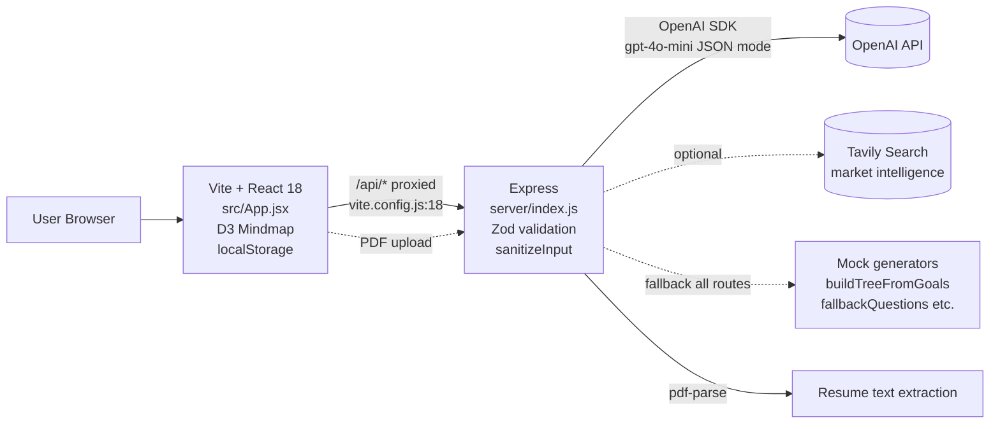

# Career GPS — Documentation Command Center

> **Purpose:** This `docs/` directory is the single source of truth for handing Career GPS to a new team. A competent developer should be able to understand the product, run it locally, trace the architecture, deploy it, and safely extend it — without the original author.

**Last audited:** 2026-09-11 | **Stack verified from:** `package.json`, `server/index.js`, `src/`, `vercel.json`

---

## Start Here (30-second orientation)

1. **Read `00_Project_Overview.md`** — what the app is, who uses it, current status, repo layout, and the 5-minute quick-start.
2. **Pick your audience path below** — then follow that track.
3. **Run the app** via `07_Local_Setup_Guide.md` (requires Node 18+, OpenAI key optional — mock fallback exists).

> **Important warnings (read before changing anything):**
> - No database exists. All persistence is browser `localStorage` / `sessionStorage` — clearing storage wipes user progress. See `04_Data_Model.md` and `23_Data_Lifecycle_Backup_and_Recovery.md`.
> - Two roadmap endpoints exist: `POST /api/init-roadmap` (lightweight 1-milestone init — `server/index.js:2319`, used by `src/App.jsx:60`) and `POST /api/generate-roadmap` (full stage-timeline roadmap — `server/index.js:771`). The full-generation contract lives at `generate-roadmap`; `init-roadmap` is the onboard path's entry. See `05_API_Documentation.md`.
> - `OPENAI_API_KEY` is server-only (`server/index.js:190`). Never set `VITE_OPENAI_API_KEY` — Vite exposes `VITE_*` vars in the browser bundle.
> - `docs/phase-notes.md` is retained verbatim as a legacy carryover; canonical docs are the numbered files.
> - Server doubles as static host locally (`server/index.js:2482` `express.static dist` + `GET /{*path}` SPA catch-all), but Vercel uses `api/index.js` serverless wrapper — see `09_Deployment_Guide.md`.

---

## Audience-Based Navigation

### For Non-Technical Stakeholders
`00_Project_Overview.md` → `01_Product_and_Business_Overview.md` → `13_User_Guide.md` → `12_Known_Issues_and_Limitations.md` → `16_Future_Roadmap.md`

### For Developers
`00_Project_Overview.md` → `03_System_Architecture.md` → `06_Folder_and_Codebase_Guide.md` → `07_Local_Setup_Guide.md` → `08_Environment_Configuration.md` → `05_API_Documentation.md` → `20_Development_and_Contribution.md`

### For QA
`02_Requirements.md` → user workflows in `01_Product_and_Business_Overview.md` → `10_Testing_and_Quality.md` → `12_Known_Issues_and_Limitations.md` → `11_Troubleshooting.md`

### For DevOps / Operations
`03_System_Architecture.md` → `08_Environment_Configuration.md` → `09_Deployment_Guide.md` → `21_Operations_and_Monitoring.md` → `23_Data_Lifecycle_Backup_and_Recovery.md` → `22_Performance_and_Scalability.md`

### For Future Maintainers
Read this README → `00_Project_Overview.md` → `03_System_Architecture.md` → `07_Local_Setup_Guide.md` → `20_Development_and_Contribution.md` → `09_Deployment_Guide.md` → `12_Known_Issues_and_Limitations.md` → `16_Future_Roadmap.md`

---

## Document Index

| # | Document | What it answers |
|---|----------|-----------------|
| 0 | [00_Project_Overview.md](00_Project_Overview.md) | What is Career GPS, stack, status, repo structure, quick start |
| 1 | [01_Product_and_Business_Overview.md](01_Product_and_Business_Overview.md) | Problem, vision, user segments, journeys, business rules |
| 2 | [02_Requirements.md](02_Requirements.md) | Functional / non-functional requirements, validations, gaps |
| 3 | [03_System_Architecture.md](03_System_Architecture.md) | Frontend, backend, data flow, diagrams, request lifecycle |
| 4 | [04_Data_Model.md](04_Data_Model.md) | No DB — localStorage keys, Zod schemas, ERD (logical) |
| 5 | [05_API_Documentation.md](05_API_Documentation.md) | All 8 API endpoints, methods, auth, request/response, refs |
| 6 | [06_Folder_and_Codebase_Guide.md](06_Folder_and_Codebase_Guide.md) | Directory map, key files, safe-to-edit vs high-risk areas |
| 7 | [07_Local_Setup_Guide.md](07_Local_Setup_Guide.md) | Reproducible local setup, verification, common failures |
| 8 | [08_Environment_Configuration.md](08_Environment_Configuration.md) | Env vars, where consumed, example values |
| 9 | [09_Deployment_Guide.md](09_Deployment_Guide.md) | Build, Vercel deploy, env wiring, verification, rollback |
| 10 | [10_Testing_and_Quality.md](10_Testing_and_Quality.md) | Only `validate:phase1` exists; what is NOT tested |
| 11 | [11_Troubleshooting.md](11_Troubleshooting.md) | Problem → Cause → Diagnosis → Fix → Verify |
| 12 | [12_Known_Issues_and_Limitations.md](12_Known_Issues_and_Limitations.md) | Bugs, debt, missing infra, security & AI limits |
| 13 | [13_User_Guide.md](13_User_Guide.md) | End-user workflows with plain language |
| 14 | [14_Admin_Guide.md](14_Admin_Guide.md) | No admin role exists — explicitly documented |
| 15 | [15_Change_Log.md](15_Change_Log.md) | Git history + manual change log |
| 16 | [16_Future_Roadmap.md](16_Future_Roadmap.md) | Confirmed TODOs vs proposed improvements |
| 17 | [17_Security_and_Privacy.md](17_Security_and_Privacy.md) | Implemented vs missing controls |
| 18 | [18_External_Integrations.md](18_External_Integrations.md) | OpenAI, Tavily (optional), PDF parse, intern platforms |
| 19 | [19_Error_Handling_and_Resilience.md](19_Error_Handling_and_Resilience.md) | Validation, sanitization, fallbacks, retry behavior |
| 20 | [20_Development_and_Contribution.md](20_Development_and_Contribution.md) | Branch, coding, lint, build, PR guidance |
| 21 | [21_Operations_and_Monitoring.md](21_Operations_and_Monitoring.md) | Logs, health checks, what does NOT exist |
| 22 | [22_Performance_and_Scalability.md](22_Performance_and_Scalability.md) | Bottlenecks, expensive ops, scaling model |
| 23 | [23_Data_Lifecycle_Backup_and_Recovery.md](23_Data_Lifecycle_Backup_and_Recovery.md) | Create → Store → Retain → Delete → Recover (no backup) |
| 24 | [24_Release_and_Versioning.md](24_Release_and_Versioning.md) | No formal release process — current practice |
| 25 | [25_Documentation_Maintenance.md](25_Documentation_Maintenance.md) | How to keep docs accurate after changes |
| AI | [ai/README.md](ai/README.md) | AI pipeline overview |
| AI | [ai/01_AI_Architecture.md](ai/01_AI_Architecture.md) | Provider, model, adapter, prompt layer |
| AI | [ai/02_Prompt_Architecture.md](ai/02_Prompt_Architecture.md) | All prompts, guardrails, template shapes |
| AI | [ai/03_Retrieval_and_RAG.md](ai/03_Retrieval_and_RAG.md) | Not Applicable — no RAG/vector DB |
| AI | [ai/04_Agent_and_Tool_Workflows.md](ai/04_Agent_and_Tool_Workflows.md) | Agentic patterns actually present vs absent |
| AI | [ai/05_AI_Limitations_and_Guardrails.md](ai/05_AI_Limitations_and_Guardrails.md) | Hallucination, cost, failure modes |
| DEC | [decisions/README.md](decisions/README.md) | ADRs derived from repo evidence |

**Legacy:** [phase-notes.md](phase-notes.md) — retained original phase carryover notes (not canonical).

---

## Architecture at a Glance



---

## Key Project Links

| Link | Location |
|------|----------|
| App entry | `src/main.jsx` → `src/App.jsx` |
| Dev server proxy | `vite.config.js:17-23` |
| Backend entry | `server/index.js` |
| Vercel deployment | `vercel.json`, `api/index.js` |
| Data definitions | `src/schemas/roadmapSchemas.js` |
| Scaffold builder | `src/data/scaffoldBuilder.js` |
| Environment template | Not present — see `08_Environment_Configuration.md` for example |
| Original overview | `CAREER_GPS_OVERVIEW.md` |
| Legacy phase notes | `docs/phase-notes.md` |

---

## Development Entry Point

```bash
npm install
# Terminal 1 — backend (requires .env)
node server/index.js
# Terminal 2 — frontend
npm run dev -- --port 5173
# open http://127.0.0.1:5173
```

Full steps, prerequisites, and verification: `07_Local_Setup_Guide.md`.

---

## Deployment Entry Point

```bash
npm run build            # → dist/
# Vercel
vercel --prod            # vercel.json rewrites /api/* → serverless function api/index.js
# env: OPENAI_API_KEY, OPENAI_MODEL, TAVILY_API_KEY (optional)
```

Full guide: `09_Deployment_Guide.md`.

---

## Documentation Status

| Criterion | Status |
|-----------|--------|
| Verified against source code | Yes — all claims cite file:line where practical |
| Secrets exposed | No |
| Invented endpoints / schema fields | No — marked `Not Confirmed` where unverifiable |
| Diagrams match implementation | Yes |
| Commands verified against `package.json` | Yes |

---

## Handover Checklist

- [x] Application purpose documented
- [x] Major features documented
- [x] User workflows documented
- [x] Architecture documented
- [x] Database documented (no DB — localStorage model documented)
- [x] APIs documented
- [x] Setup verified
- [x] Environment variables documented
- [x] Deployment documented
- [x] Testing documented (including what is NOT tested)
- [x] Known issues documented
- [x] Security documented
- [x] External integrations documented
- [x] Operational procedures documented
- [x] Backup/recovery status documented (no verified backup)
- [x] AI architecture documented
- [x] Technical debt documented
- [x] Future work documented (confirmed vs proposed split)
- [x] Root README links to documentation
- [x] Documentation reviewed for stale/conflicting information

> Next steps after reading this README: go to `00_Project_Overview.md`.
