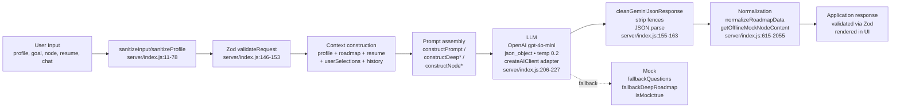

# AI Documentation — Career GPS

> Career GPS is deeply AI-dependent, but grounded in a **prompt-only, no-RAG, no-vector-DB** architecture. This directory is the authoritative reference for every AI surface. All claims cite `server/index.js:line` or frontend prompt helpers.

## Pipeline at a Glance

No retrieval, embeddings, or tool-use are involved — see `03_Retrieval_and_RAG.md`.

---

## Document Map

| File | Covers | When to read |
|------|--------|-------------|
| [01_AI_Architecture.md](01_AI_Architecture.md) | Provider, model, adapter, config, which routes use AI vs offline mock | Start here for any AI change |
| [02_Prompt_Architecture.md](02_Prompt_Architecture.md) | Every prompt template, guardrails, stage rules, JSON schemas demanded of the LLM | Before editing prompts or hallucination fixes |
| [03_Retrieval_and_RAG.md](03_Retrieval_and_RAG.md) | Explicitly `Not Applicable` — no embeddings/vector DB/retrieval | To avoid false assumptions |
| [04_Agent_and_Tool_Workflows.md](04_Agent_and_Tool_Workflows.md) | Which agentic patterns are present (chat/markdown follow-ups) vs absent (tool calling, memory, planner) | Before claiming agentic capability |
| [05_AI_Limitations_and_Guardrails.md](05_AI_Limitations_and_Guardrails.md) | Hallucination, cost, token controls, prompt-injection defenses, retry gap, failure modes | Risk assessment |
